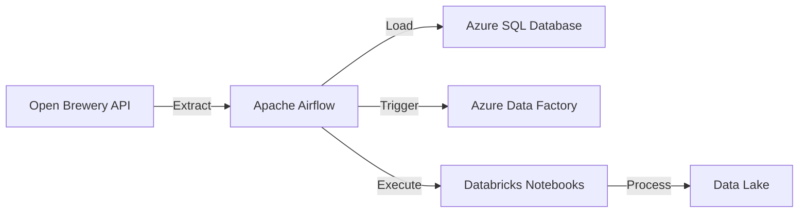

# Desafio InBev - Data Orchestration Platform


## 📋 Descrição

Plataforma de orquestração de dados desenvolvida com Apache Airflow para gerenciar pipelines de dados envolvendo Azure Cloud Services e Databricks. O projeto automatiza a extração, transformação e carga (ETL) de dados de cervejarias através de APIs públicas e processamento em plataformas cloud.

## 📖 Documentação

**📘 [Acesse a documentação completa →](https://victorcappelleto.github.io/Desafio_InBev/)**

A documentação oficial está hospedada no GitHub Pages e inclui:
- 🏗️ **Arquitetura**: Clean Architecture, Domain Layer, Use Cases, Repository Pattern
- ✅ **Data Quality**: Framework com 6 dimensões ISO 8000
- 📊 **Observability**: Métricas, anomalias e alertas
- 🚀 **Setup**: Guias de instalação e configuração
- 🛠️ **DAGs**: Documentação detalhada de cada pipeline

**Desenvolvimento Local:**
```bash
# Ver documentação localmente
poetry run task doc         # Inicia servidor em http://localhost:8000

# Build da documentação
poetry run task doc-build   # Gera site/ folder

# Deploy manual (opcional)
poetry run task doc-deploy  # Publica no GitHub Pages
```

### ✨ Destaques

- 🏛️ **Clean Architecture + DDD:** Domain Layer, Use Cases, Repository Pattern completos
- ✅ **Data Quality Framework:** 6 dimensões ISO 8000 (Completeness, Accuracy, Validity, etc)
- 📊 **Observability:** Metrics Collection, Anomaly Detection, Multi-channel Alerts
- 🔒 **Segurança:** Credenciais gerenciadas via variáveis de ambiente e Airflow Connections
- 🐳 **Docker Otimizado:** Microsoft ODBC Driver 18 pré-configurado para Azure SQL
- ⚙️ **Configuração Simplificada:** `airflow_settings.yaml` pré-configurado para desenvolvimento local
- 📦 **Dependências Completas:** Sistema e Python totalmente documentados
- 🚀 **Pronto para Produção:** Estrutura preparada para deployment em Astronomer ou Kubernetes
- 📝 **Logging Profissional:** Sistema de logs padronizado com utilitários prontos para uso
- 🛠️ **Dev Tools:** Black, isort, pytest configurados + 8 comandos taskipy úteis
- 📋 **Rastreabilidade:** Git history com conventional commits para tracking completo

## 🏗️ Arquitetura



### 🏛️ Arquitetura de Software (SOLID)

O projeto implementa **princípios SOLID** e **padrões de design profissionais**:

#### 📐 Princípios SOLID

| Princípio | Implementação | Exemplo |
|-----------|---------------|---------|
| **S**ingle Responsibility | Cada classe tem uma única responsabilidade | `BreweryAPIExtractor`: apenas extração |
| **O**pen/Closed | Aberto para extensão, fechado para modificação | Nova fonte? Implemente `IDataExtractor` |
| **L**iskov Substitution | Interfaces garantem substituição | Qualquer `IDataExtractor` é intercambiável |
| **I**nterface Segregation | Interfaces focadas e minimalistas | `IDataExtractor`, `IDataLoader`, `IDataTransformer` |
| **D**ependency Inversion | Depende de abstrações, não implementações | Configs injetadas via DI |

#### 🎨 Padrões de Design

| Padrão | Classe | Benefício |
|--------|--------|-----------|
| **Factory** | `ETLFactory` | Centraliza criação de objetos |
| **Strategy** | `IDataExtractor` | Troca de estratégias |
| **Dependency Injection** | `*Config` | Testabilidade |
| **Repository** | `Services` | Abstração de dados |

#### 📦 Estrutura em Camadas (Clean Architecture)

```
dags/
├── domain/              # 🟢 DOMAIN LAYER (Business Rules)
│   ├── value_objects.py # Coordinates, Address, Location, Contact, BreweryType
│   ├── entities.py      # Brewery, BreweryAggregate
│   ├── exceptions.py    # Domain-specific exceptions
│   └── validators.py    # Business rule validators
├── use_cases/           # 🔵 USE CASES (Application Logic)
│   ├── extract.py       # ExtractBreweriesUseCase
│   ├── transform.py     # TransformBreweriesUseCase
│   ├── load.py          # LoadBreweriesUseCase
│   └── quality.py       # ValidateBreweriesQualityUseCase
├── repositories/        # 🟣 ADAPTERS (Data Access)
│   ├── base.py          # IRepository, IBreweryRepository
│   ├── brewery_repository.py # InMemory, SQL implementations
│   └── unit_of_work.py  # Transaction management
├── data_quality/        # ✅ DATA QUALITY FRAMEWORK
│   ├── framework.py     # DataQualityEngine, DataQualityCheck
│   ├── dimensions.py    # 6 ISO dimensions (Completeness, Accuracy, etc)
│   └── rules/           # Brewery-specific rules
├── observability/       # 📊 OBSERVABILITY FRAMEWORK
│   ├── metrics.py       # DataMetrics, MetricsCollector
│   └── alerts/          # EmailAlerter, SlackAlerter
├── config/              # ⚙️ CONFIGURATION
│   └── settings.py      # AzureSQLConfig, DatabricksConfig, etc
├── interfaces/          # 📋 INTERFACES (Contracts)
│   ├── data_extractor.py
│   ├── data_loader.py
│   └── data_transformer.py
├── services/            # 🔧 SERVICES (Implementations)
│   ├── brewery_api_extractor.py
│   ├── azure_sql_loader.py
│   └── brewery_transformer.py
├── factories/           # 🏭 FACTORIES
│   └── etl_factory.py
├── utils/               # 🛠️ UTILITIES
│   └── logger.py
├── exceptions.py        # 🚨 EXCEPTIONS
└── *.py                 # 🚀 DAGs (Orchestration)
```

#### ✨ Benefícios da Arquitetura

✅ **Testabilidade**: Cada componente pode ser testado isoladamente  
✅ **Manutenibilidade**: Mudanças localizadas, sem efeito dominó  
✅ **Extensibilidade**: Adicione novas fontes sem modificar código existente  
✅ **Reusabilidade**: Services podem ser usados em múltiplas DAGs  
✅ **Type Safety**: Type hints completos para suporte de IDE  
✅ **Profissionalismo**: Padrões de indústria reconhecidos  

## 🚀 Tecnologias

- **Apache Airflow** - Orquestração de workflows
- **Azure SQL Database** - Armazenamento de dados estruturados
- **Azure Data Factory** - Integração e transformação de dados
- **Databricks** - Processamento de dados em larga escala
- **Docker** - Containerização
- **Python 3.11** - Linguagem de programação
- **Poetry** - Gerenciamento de dependências
- **Astronomer Runtime** - Runtime otimizado do Airflow

## 📦 Estrutura do Projeto

```
Desafio_InBev/
├── dags/                                    # DAGs do Airflow
│   ├── execute_notebook_databricks.py       # Executa notebooks no Databricks
│   ├── extract_data_api_slq_azure.py       # Extrai dados da API para Azure SQL
│   └── trigger_data_factory_azure.py       # Dispara pipelines no ADF
├── tests/                                   # Testes automatizados
│   └── dags/
│       └── test_dag_example.py             # Testes das DAGs
├── docs/                                    # Documentação MkDocs
│   └── index.md
├── .dockerignore                            # Arquivos ignorados no build Docker
├── .gitignore                              # Arquivos ignorados no Git
├── .python-version                         # Versão Python do projeto (3.11.5)
├── Dockerfile                               # Imagem Docker otimizada com ODBC Driver
├── airflow_settings.yaml                    # Connections, Pools e Variables (local dev)
├── packages.txt                            # Dependências do sistema (ODBC, etc)
├── pyproject.toml                          # Configuração Poetry (dev dependencies)
├── requirements.txt                         # Dependências Python do Airflow
├── mkdocs.yml                              # Configuração da documentação
└── README.md
```

## 📊 DAGs Disponíveis

### 🚀 DAGs de Produção (Arquitetura SOLID)

| DAG | Frequência | Função | Status |
|-----|------------|--------|--------|
| `brewery_etl_solid` | Diária | ETL completo de dados de cervejarias | ✅ Produção |
| `databricks_processing_solid` | Diária | Processamento Databricks (Silver layer) | ✅ Produção |
| `azure_data_factory_solid` | Diária | Trigger de pipelines ADF | ✅ Produção |
| `data_quality_check_solid` | Diária | Verificação de qualidade de dados | ✅ Produção |
| `system_health_monitor_solid` | 30 min | Monitoramento de saúde do sistema | ✅ Produção |

---

### 1. `brewery_etl_solid` - ETL Completo

**Descrição:** Pipeline ETL completo com arquitetura SOLID

**Tarefas:**
1. `extract_task` - Extrai dados via `BreweryAPIExtractor`
2. `transform_task` - Transforma via `BreweryTransformer`  
3. `load_task` - Carrega via `AzureSQLLoader`

**Features:**
- ✅ Retry logic com exponential backoff
- ✅ Data validation
- ✅ MERGE statements (upsert)
- ✅ Logging estruturado
- ✅ Exception handling profissional

**Tecnologias:** Python, requests, pyodbc, Azure SQL

---

### 2. `databricks_processing_solid` - Databricks

**Descrição:** Executa notebook Databricks com validações

**Tarefas:**
1. `validate_config` - Validação fail-fast de configurações
2. `run_databricks_notebook` - Executa notebook com parâmetros

**Features:**
- ✅ Validação antes de execução cara
- ✅ Parâmetros contextuais (execution_date, run_id)
- ✅ Type safety

**Tecnologias:** Databricks, Spark

---

### 3. `azure_data_factory_solid` - ADF

**Descrição:** Dispara pipelines Azure Data Factory com auditoria

**Tarefas:**
1. `validate_config` - Valida credenciais e configurações
2. `log_parameters` - Cria audit trail
3. `run_adf_pipeline` - Executa pipeline

**Features:**
- ✅ Validação de credenciais
- ✅ Auditoria completa
- ✅ Rastreamento de execução

**Tecnologias:** Azure Data Factory

---

### 4. `data_quality_check_solid` - Qualidade de Dados

**Descrição:** Validação automática de qualidade de dados

**Checks:**
- ✅ Row count validation (>= 100 rows)
- ✅ Null value detection em campos críticos
- ✅ Duplicate detection por ID
- ✅ Data freshness check

**Features:**
- ✅ Execução paralela de checks
- ✅ Fail-fast em problemas de qualidade
- ✅ Relatório consolidado
- ✅ Alertas automáticos

**Frequência:** Diária (após ETL)

---

### 5. `system_health_monitor_solid` - Monitoramento

**Descrição:** Health checks de todos os componentes do sistema

**Checks:**
- ✅ Azure SQL connectivity & performance
- ✅ Databricks workspace availability
- ✅ Brewery API endpoint health
- ✅ Airflow self-check

**Features:**
- ✅ Execução a cada 30 minutos
- ✅ Checks isolados (failures não cascateiam)
- ✅ Response time tracking
- ✅ Health report consolidado
- ✅ Email alerts em failures

**Frequência:** A cada 30 minutos

---

### 💡 Arquitetura das DAGs

Todas as DAGs seguem os mesmos princípios:

```python
# 1. Configuration (Dependency Injection)
config = DatabricksConfig()

# 2. Factory Pattern
service = ETLFactory.create_service(config)

# 3. Professional Logging
log_task_start(logger, "task_name")
log_task_success(logger, "task_name", records=100)

# 4. Exception Handling
try:
    result = service.execute()
except CustomException as e:
    log_task_error(logger, "task_name", e)
    raise
```

**Ver exemplo completo:** [config_usage_example.py](dags/examples/config_usage_example.py)

## 🛠️ Setup e Instalação

### Pré-requisitos

- **Python 3.11+**
- **Docker & Docker Compose**
- **Astronomer CLI** (recomendado) ou Docker puro
- **Poetry** (opcional, para desenvolvimento local)

### 🚀 Quick Start com Astronomer CLI (Recomendado)

1. **Clone o repositório**
   ```bash
   git clone <repository-url>
   cd Desafio_InBev
   ```

2. **Instale o Astronomer CLI**
   ```bash
   # macOS
   brew install astronomer/tap/astro
   
   # Linux
   curl -sSL install.astronomer.io | sudo bash -s
   ```

3. **Configure variáveis de ambiente**
   ```bash
   # Crie um arquivo .env na raiz do projeto com suas credenciais
   # Veja a seção "Variáveis de Ambiente" abaixo
   nano .env
   ```

4. **Inicie o ambiente Airflow**
   ```bash
   # Primeira vez (build + start)
   astro dev start
   
   # Rebuild após mudanças no Dockerfile ou requirements.txt
   astro dev restart
   ```

5. **Acesse a interface web**
   - **URL:** http://localhost:8080
   - **Usuário:** `admin`
   - **Senha:** `admin`

### 🐳 Instalação com Docker (Alternativa)

```bash
# Build da imagem
docker build -t desafio-inbev .

# Run do container
docker run -p 8080:8080 --env-file .env desafio-inbev
```

> **⚠️ Nota:** O método com Astronomer CLI é recomendado pois gerencia automaticamente o scheduler, webserver e outros componentes do Airflow.

## ⚙️ Configuração

### 🔐 Variáveis de Ambiente (Obrigatório)

Crie um arquivo `.env` na raiz do projeto com suas credenciais:

```env
# ==============================================================================
# Azure SQL Database
# ==============================================================================
AZURE_SQL_PASSWORD=SUA_SENHA_AZURE_SQL

# ==============================================================================
# Databricks
# ==============================================================================
DATABRICKS_HOST=https://adb-XXXXX.XX.azuredatabricks.net
DATABRICKS_TOKEN=dapi********************************
DATABRICKS_CLUSTER_ID=XXXX-XXXXXX-XXXXXXXX
DATABRICKS_JOB_ID=XXXXXXXXXXXXX
DATABRICKS_NOTEBOOK_PATH=/Workspace/Users/your.email@example.com/your_notebook_name

# ==============================================================================
# Azure Data Factory
# ==============================================================================
ADF_TENANT_ID=xxxxxxxx-xxxx-xxxx-xxxx-xxxxxxxxxxxx
ADF_SUBSCRIPTION_ID=xxxxxxxx-xxxx-xxxx-xxxx-xxxxxxxxxxxx
ADF_CLIENT_ID=xxxxxxxx-xxxx-xxxx-xxxx-xxxxxxxxxxxx
ADF_CLIENT_SECRET=seu_client_secret
```

> **💡 Dica:** O arquivo `airflow_settings.yaml` já está configurado para ler essas variáveis automaticamente!

### 📡 Airflow Connections (Pré-configuradas)

As seguintes conexões são **automaticamente configuradas** via `airflow_settings.yaml` para desenvolvimento local:

#### 1. **Azure SQL Database** (`azure_sql_default`)
```yaml
Conn Type: ODBC
Host: inbev-sql-server.database.windows.net
Database: inbev_db
Login: inbev_admin
Password: ${AZURE_SQL_PASSWORD}  # Do arquivo .env
Driver: ODBC Driver 18 for SQL Server
```

#### 2. **Databricks** (`databricks_default`)
```yaml
Conn Type: Databricks
Host: ${DATABRICKS_HOST}         # Do arquivo .env
Token: ${DATABRICKS_TOKEN}       # Do arquivo .env
```

#### 3. **Azure Data Factory** (`azure_data_factory_default`)
```yaml
Conn Type: Azure Data Factory
Client ID: ${ADF_CLIENT_ID}      # Do arquivo .env
Client Secret: ${ADF_CLIENT_SECRET}  # Do arquivo .env
Tenant ID: ${ADF_TENANT_ID}      # Do arquivo .env
Subscription ID: ${ADF_SUBSCRIPTION_ID}  # Do arquivo .env
```

> **⚠️ Para Produção:** Configure as connections diretamente no Airflow UI ou use Azure Key Vault.

### 🎯 Airflow Variables (Pré-configuradas)

As seguintes variables são automaticamente configuradas via `airflow_settings.yaml`:

| Variable | Descrição | Fonte |
|----------|-----------|-------|
| `databricks_cluster_id` | ID do cluster Databricks | `.env` |
| `databricks_job_id` | ID do job Databricks | `.env` |
| `databricks_notebook_path` | Caminho do notebook | `.env` |
| `adf_resource_group` | Resource group do ADF | Fixo |
| `adf_factory_name` | Nome do Data Factory | Fixo |
| `adf_pipeline_name` | Nome da pipeline | Fixo |
| `brewery_api_url` | URL da API de cervejarias | Fixo |
| `environment` | Ambiente (dev/prod) | Fixo |

### 🏊 Airflow Pools (Pré-configurados)

| Pool | Slots | Descrição |
|------|-------|-----------|
| `azure_pool` | 5 | Para operações Azure (SQL, ADF) |
| `databricks_pool` | 3 | Para jobs Databricks |

## 🧪 Desenvolvimento

### 🏗️ Infraestrutura e Dependências

O projeto está configurado com três camadas de dependências:

#### 1. **Dependências do Sistema** (`packages.txt`)
```
unixodbc           # Driver ODBC base
unixodbc-dev       # Headers de desenvolvimento ODBC
gnupg              # Verificação de assinaturas GPG
curl               # Download de pacotes
apt-transport-https # Repositórios HTTPS
```

#### 2. **Microsoft ODBC Driver** (`Dockerfile`)
O **Microsoft ODBC Driver 18 for SQL Server** é instalado automaticamente via Dockerfile:
- ✅ Configurado para Azure SQL Database
- ✅ Suporte a TLS/SSL
- ✅ Compatível com pyodbc

#### 3. **Dependências Python** (`requirements.txt`)
```python
apache-airflow-providers-microsoft-azure==10.1.2  # Azure providers
apache-airflow-providers-databricks==6.6.0        # Databricks provider
pyodbc==5.1.0                                      # SQL Server connectivity
requests==2.32.3                                   # HTTP requests
```

### 📦 Gerenciamento de Dependências

#### Adicionar nova dependência do Airflow
```bash
# Adicione ao requirements.txt
echo "nova-lib==1.0.0" >> requirements.txt

# Rebuild o container
astro dev restart
```

#### Adicionar dependência do sistema
```bash
# Adicione ao packages.txt
echo "nome-do-pacote" >> packages.txt

# Rebuild o container
astro dev restart
```

#### Adicionar nova dependência Python para desenvolvimento local (Poetry)
```bash
poetry add <package>
```

### 📝 Sistema de Logging

O projeto inclui um sistema de logging padronizado para DAGs.

#### Usar o logger nas DAGs:

```python
from utils.logger import get_logger, log_task_start, log_task_success, log_task_error

# Criar logger
logger = get_logger(__name__)

# Log início da task
log_task_start(logger, "extract_data", source="API", target="Database")

try:
    # Sua lógica aqui
    result = extract_data()
    
    # Log sucesso com métricas
    log_task_success(
        logger, 
        "extract_data", 
        records=len(result),
        duration="2.3s"
    )
except Exception as e:
    # Log erro com contexto
    log_task_error(logger, "extract_data", e, retry_count=1)
    raise
```

#### Configurar nível de log:

```bash
# No arquivo .env
LOG_LEVEL=DEBUG  # Options: DEBUG, INFO, WARNING, ERROR, CRITICAL

# Ou via Airflow
AIRFLOW__LOGGING__LOGGING_LEVEL=INFO
```

#### Ver logs:

```bash
# Logs em tempo real
astro dev logs --follow

# Logs de serviço específico
astro dev logs --scheduler --follow
astro dev logs --webserver --follow

# Logs de uma task específica
astro dev run tasks logs <dag_id> <task_id> <execution_date>
```

### 🎨 Formatação de Código

```bash
# Formate o código (isort + black)
poetry run task format

# Verifique formatação sem modificar
poetry run task lint

# Manualmente:
poetry run isort .
poetry run black .
```

### 🧪 Testes

O projeto possui **suite completa de testes** com **Unit Tests** e **Integration Tests**:

#### **Test Coverage: ~85%** ✅

```
tests/
├── test_config.py              # Unit: Configuration
├── test_services.py            # Unit: ETL Services
└── integration/                # Integration Tests
    ├── test_full_pipeline.py   # E2E: Complete pipeline
    ├── test_repositories.py    # Repository + Unit of Work
    ├── test_use_cases.py       # Application logic
    └── test_domain_layer.py    # Domain entities + validation
```

**Comandos:**

```bash
# Execute todos os testes
poetry run task test

# Testes com cobertura HTML
poetry run task test-cov
# Relatório gerado em htmlcov/index.html

# Apenas integration tests
poetry run pytest tests/integration/ -v

# Apenas unit tests
poetry run pytest tests/test_*.py -v

# Execute todos os checks (lint + test)
poetry run task check

# Teste específico
poetry run pytest tests/integration/test_full_pipeline.py::TestFullETLPipeline::test_full_pipeline_success -v
```

**[Ver Guia Completo de Testes →](tests/README.md)**

### ⚡ Comandos Úteis (Taskipy)

O projeto inclui 8 comandos prontos para desenvolvimento:

```bash
# Formatação
poetry run task format      # Formata código (isort + black)
poetry run task lint         # Verifica formatação sem modificar

# Testes
poetry run task test         # Executa testes
poetry run task test-cov     # Testes com cobertura
poetry run task check        # Lint + testes (CI-ready)

# Documentação
poetry run task doc          # Inicia servidor docs
poetry run task doc-build    # Build documentação estática

# Limpeza
poetry run task clean        # Remove arquivos temporários

# Utilitários
poetry run task kill         # Mata processo na porta 8000
```


## 📝 Boas Práticas

### DAGs
- ✅ Todas as DAGs devem ter `tags` definidas
- ✅ `retries` deve ser >= 2
- ✅ Use `catchup=False` para evitar backfills indesejados
- ✅ Defina `depends_on_past` apropriadamente

### Código
- ✅ Siga PEP 8 (use `black` e `isort`)
- ✅ Escreva testes para novas DAGs
- ✅ Documente funções e classes complexas
- ✅ Use type hints

## 🔐 Segurança

⚠️ **IMPORTANTE**: 
- **Nunca commite credenciais no código** - Passwords, tokens e API keys devem estar no `.env`
- **Use Airflow Connections e Variables** - Dados sensíveis gerenciados pelo Airflow
- **Utilize Azure Key Vault** - Para secrets em produção
- **Mantenha o arquivo `.env` no `.gitignore`** - Já configurado
- **Use placeholders genéricos** - Em documentação e templates (ex: `XXXX-XXXXXX`, `your.email@example.com`)
- **Não exponha IDs reais** - Cluster IDs, Job IDs, emails pessoais devem ser secrets

### 🔒 Boas Práticas de Secrets

✅ **Faça:**
```bash
# Use variáveis de ambiente
DATABRICKS_TOKEN=${DATABRICKS_TOKEN}
DATABRICKS_CLUSTER_ID=${DATABRICKS_CLUSTER_ID}

# Use Airflow Variables
cluster_id = Variable.get("databricks_cluster_id")
```

❌ **Não Faça:**
```python
# NUNCA hardcode valores reais
token = "dapi123456789..."  # ❌
cluster_id = "0626-205409-935ntddc"  # ❌
email = "meu.email@real.com"  # ❌
```

### 🎭 Placeholders Recomendados

Use estes formatos em documentação e exemplos:

| Tipo | Placeholder | Exemplo |
|------|-------------|---------|
| **Databricks Cluster** | `XXXX-XXXXXX-XXXXXXXX` | `1234-567890-abcd1234` |
| **Job ID** | `XXXXXXXXXXXXX` | `1234567890123` |
| **Token** | `dapi********************************` | `dapi1234...` |
| **Email** | `your.email@example.com` | `user@example.com` |
| **GUID/UUID** | `xxxxxxxx-xxxx-xxxx-xxxx-xxxxxxxxxxxx` | `12345678-...` |
| **Password** | `YOUR_PASSWORD_HERE` | - |

## 📈 Monitoramento

- **Airflow UI**: Monitore execuções, logs e métricas
- **Azure Monitor**: Acompanhe recursos Azure
- **Databricks Jobs**: Verifique execução de notebooks

## 🤝 Contribuindo

1. Crie uma branch para sua feature (`git checkout -b feature/nova-feature`)
2. Commit suas mudanças (`git commit -m 'Adiciona nova feature'`)
3. Push para a branch (`git push origin feature/nova-feature`)
4. Abra um Pull Request

## 📚 Recursos Adicionais

### Documentação Externa
- [Apache Airflow Documentation](https://airflow.apache.org/docs/)
- [Astronomer Documentation](https://docs.astronomer.io/)
- [Azure Data Factory](https://docs.microsoft.com/azure/data-factory/)
- [Databricks Documentation](https://docs.databricks.com/)
- [Azure Key Vault Best Practices](https://docs.microsoft.com/azure/key-vault/general/best-practices)

## 🐛 Troubleshooting

### 🔍 Diagnóstico Geral

```bash
# Verifique logs do Airflow
astro dev logs

# Verifique logs de um serviço específico
astro dev logs --scheduler
astro dev logs --webserver

# Liste DAGs e erros de import
astro dev run dags list-import-errors
```

### ❌ DAG não aparece no Airflow

**Sintomas:** DAG não aparece na interface web

**Soluções:**
```bash
# 1. Verifique erros de sintaxe Python
python3 dags/seu_dag.py

# 2. Verifique erros de import no Airflow
astro dev run dags list-import-errors

# 3. Force refresh do scheduler
astro dev restart
```

### 🔌 Problemas de Conexão Azure SQL

**Sintomas:** `Error connecting to database`, `ODBC Driver not found`

**Soluções:**
```bash
# 1. Verifique se o ODBC Driver está instalado
astro dev bash
odbcinst -q -d

# 2. Teste a conexão
astro dev run connections test azure_sql_default

# 3. Verifique variáveis de ambiente
astro dev run variables list

# 4. Rebuild com cache limpo
astro dev stop
astro dev kill
astro dev start --build
```

**Erro comum:**
```
pyodbc.Error: ('01000', "[01000] [unixODBC][Driver Manager]Can't open lib 'ODBC Driver 18 for SQL Server'")
```
**Solução:** O Dockerfile não foi buildado corretamente. Execute `astro dev kill` e `astro dev start`.

### 🔑 Problemas com Variáveis de Ambiente

**Sintomas:** `KeyError`, variables vazias, connections não funcionam

**Soluções:**
```bash
# 1. Verifique se o .env existe
ls -la .env

# 2. Verifique o conteúdo (sem expor secrets)
cat .env | grep -v "PASSWORD\|TOKEN\|SECRET"

# 3. Verifique se as variáveis estão sendo lidas
astro dev run variables list

# 4. Restart para recarregar .env
astro dev restart
```

### 🐳 Container não inicia

**Sintomas:** Container fica em loop de restart ou falha ao iniciar

**Soluções:**
```bash
# 1. Limpe tudo e reconstrua
astro dev stop
astro dev kill
docker system prune -a --volumes  # ⚠️ Remove TODOS os containers/volumes
astro dev start

# 2. Verifique portas em uso
lsof -i :8080
lsof -i :5432

# 3. Verifique espaço em disco
df -h

# 4. Verifique memória disponível
docker stats
```

### 📊 DAG travada ou não executa

**Sintomas:** DAG mostra "running" mas não progride

**Soluções:**
```bash
# 1. Verifique tasks em execução
astro dev run tasks list

# 2. Clear task específica
astro dev run tasks clear <dag_id> -t <task_id>

# 3. Verifique pools disponíveis
astro dev run pools list

# 4. Aumente slots do pool se necessário
astro dev run pools set <pool_name> 10
```

### 🔐 Erro de Autenticação (Azure/Databricks)

**Sintomas:** `Authentication failed`, `Invalid token`, `403 Forbidden`

**Checklist:**
- [ ] Variáveis de ambiente estão corretas no `.env`
- [ ] Tokens não expiraram
- [ ] Service Principal tem permissões corretas
- [ ] Firewall/Network está permitindo conexão
- [ ] Connections no Airflow estão apontando para as variáveis certas

```bash
# Teste manualmente a autenticação
astro dev bash
python3 -c "import os; print(os.getenv('DATABRICKS_TOKEN'))"
```

### 📝 Logs Úteis

```bash
# Logs do scheduler (processamento de DAGs)
astro dev logs --scheduler --follow

# Logs do webserver (interface web)
astro dev logs --webserver --follow

# Logs de uma task específica
astro dev run tasks logs <dag_id> <task_id> <execution_date>

# Entre no container para debug
astro dev bash
```

---

## 🚀 CI/CD Pipeline

O projeto possui um **pipeline completo de CI/CD** configurado com **GitHub Actions**, garantindo qualidade, segurança e automação em todo o ciclo de desenvolvimento.

### 📋 Workflows Disponíveis

#### 1. **CI - Continuous Integration** (`ci.yml`)

Executa em **push** e **pull requests** para branches `main` e `develop`.

**Jobs:**
- 🎨 **Lint & Format Check** - Black, isort
- 🧪 **Unit Tests** - pytest com coverage (>60%)
- 🔒 **Security Checks** - Bandit, TruffleHog
- ✈️ **DAG Validation** - Valida sintaxe de todas as DAGs
- 🐳 **Docker Build Test** - Build da imagem Docker
- 📚 **Documentation Build** - Build do MkDocs

**Duração:** ~5-8 minutos

---

#### 2. **CD - Continuous Deployment** (`cd.yml`)

Executa em **push para main** ou **tags vX.X.X**.

**Jobs:**
- 📦 **Create Release** - Cria release no GitHub (apenas para tags)
- 📚 **Deploy Documentation** - Publica docs no GitHub Pages
- 🐳 **Docker Push** - Envia imagem para GHCR
- 🚀 **Deploy to Astronomer** (opcional, desabilitado por padrão)

**Duração:** ~3-5 minutos

---

#### 3. **Security Scanning** (`security.yml`)

Executa em **push, PRs** e **semanalmente** (segunda-feira 9h).

**Scans:**
- 🔍 **Secret Scanning** - TruffleHog
- 🔒 **Dependency Audit** - Safety
- 🛡️ **SAST** - Bandit
- 🔬 **CodeQL Analysis** - GitHub Advanced Security
- 🐳 **Docker Security** - Trivy
- ⚖️ **License Compliance** - pip-licenses

**Duração:** ~10-12 minutos

---

#### 4. **PR Checks** (`pr-checks.yml`)

Executa em **pull requests** para adicionar automação.

**Features:**
- 📝 **PR Title Check** - Valida Conventional Commits
- 📏 **PR Size Check** - Calcula tamanho do PR
- ✅ **PR Checklist** - Posta checklist automático
- 🏷️ **Auto Labeler** - Adiciona labels baseado em arquivos alterados

---

### 🔧 Configurações Adicionais

#### **Dependabot** (`dependabot.yml`)
- 📦 Atualiza dependências Python semanalmente
- 🔄 Atualiza GitHub Actions mensalmente
- 🐳 Atualiza Dockerfile mensalmente

#### **Code Owners** (`CODEOWNERS`)
- 👤 Define revisores automáticos por arquivo/diretório
- ✅ Garante revisão de mudanças críticas

#### **Issue Templates**
- 🐛 Bug Report
- ✨ Feature Request

#### **PR Template**
- 📋 Checklist completo
- 🏷️ Labels automáticas
- ✅ Status de CI

---

### 🎯 Como Usar o CI/CD

#### **Desenvolvimento Normal**

```bash
# 1. Crie uma branch
git checkout -b feat/nova-dag

# 2. Faça suas mudanças
# ... edite código ...

# 3. Rode testes localmente (opcional, mas recomendado)
poetry run task test
poetry run task lint

# 4. Commit seguindo Conventional Commits
git commit -m "feat: add new data quality DAG"

# 5. Push para o GitHub
git push origin feat/nova-dag
```

**O CI vai automaticamente:**
- ✅ Rodar lint
- ✅ Executar testes
- ✅ Fazer security scan
- ✅ Validar DAGs
- ✅ Build Docker

---

#### **Criando uma Release**

```bash
# 1. Crie uma tag com semantic versioning
git tag -a v1.0.0 -m "Release version 1.0.0"

# 2. Push da tag
git push origin v1.0.0
```

**O CD vai automaticamente:**
- 📦 Criar release no GitHub
- 📚 Publicar documentação
- 🐳 Enviar imagem Docker

---

### 📊 Monitorando CI/CD

- **Status:** Veja badges no topo do README
- **Detalhes:** Acesse a aba **Actions** no GitHub
- **Security:** Acesse a aba **Security** no GitHub
- **Coverage:** Download artifacts do workflow CI

---

### 🛡️ Security Scanning Schedule

| Scan | Frequência | Job |
|------|------------|-----|
| Secret Scanning | Push/PR + Semanal | TruffleHog |
| Dependency Audit | Push/PR + Semanal | Safety |
| SAST | Push/PR + Semanal | Bandit |
| CodeQL | Push/PR + Semanal | GitHub |
| Docker Security | Push/PR + Semanal | Trivy |

---

### 🔗 Links Úteis

- [GitHub Actions Docs](https://docs.github.com/en/actions)
- [Astronomer Deploy Guide](https://docs.astronomer.io/astro/deploy-code)
- [Conventional Commits](https://www.conventionalcommits.org/)

---

## 📄 Licença

Este projeto foi desenvolvido como parte de um desafio técnico.

## ✍️ Autor

**Victor Castro**
- Email: victorcappelletto@gmail.com

---

⭐ Se este projeto foi útil, considere dar uma estrela!
