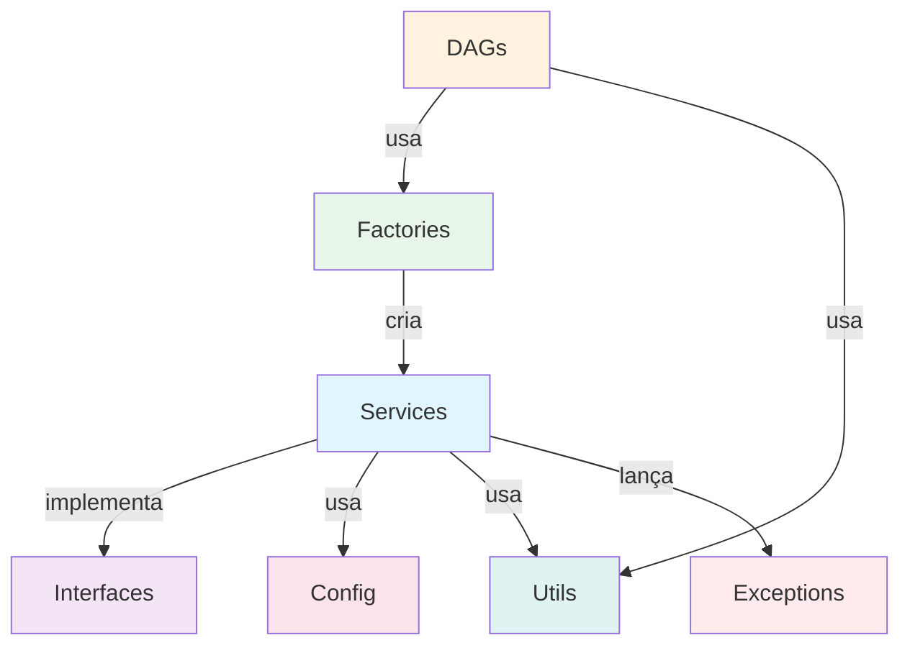

# Componentes da Arquitetura

## Estrutura de Diretórios

```
dags/
 config/ # Configurações
 __init__.py
 settings.py # Dataclasses

 interfaces/ # Abstrações
 __init__.py
 data_extractor.py
 data_loader.py
 data_transformer.py

 services/ # Implementações
 __init__.py
 brewery_api_extractor.py
 azure_sql_loader.py
 brewery_transformer.py

 factories/ # Criação de Objetos
 __init__.py
 etl_factory.py

 utils/ # Utilitários
 __init__.py
 logger.py

 examples/ # Exemplos
 __init__.py
 config_usage_example.py

 exceptions.py # Exceções

 *.py # DAGs
 brewery_etl_dag.py
 databricks_processing_dag.py
 azure_data_factory_dag.py
```

## Componentes Principais

### 1. Config (settings.py)

**Dataclasses imutáveis** para configurações type-safe.

#### DatabricksConfig

```python
@dataclass(frozen=True)
class DatabricksConfig:
 host: str
 token: str
 cluster_id: str
 job_id: str
 notebook_path: str

 @property
 def connection_id(self) -> str:
 return "databricks_default"
```

**Features:**
- Frozen (imutável)
- Default values de environment variables
- Type hints completos
- Safe `__repr__` (não expõe secrets)

#### AzureSQLConfig

```python
@dataclass(frozen=True)
class AzureSQLConfig:
 server: str
 database: str
 username: str
 password: str
 port: int
 driver: str

 @property
 def connection_string(self) -> str:
 # Build ODBC connection string
 ...
```

#### Outros Configs

- `AzureDataFactoryConfig` - Configurações ADF
- `APIConfig` - URLs e timeouts de APIs
- `AirflowConfig` - Comportamento do Airflow

---

### 2. Interfaces

#### IDataExtractor

**Contrato para extração de dados.**

```python
class IDataExtractor(ABC):
 @abstractmethod
 def extract(self) -> List[Dict[str, Any]]:
 """Extract data from source."""
 pass

 @abstractmethod
 def validate_data(self, data: List[Dict]) -> bool:
 """Validate extracted data."""
 pass
```

**Implementações:**
- `BreweryAPIExtractor` - Extrai dados da API

**Futuras implementações:**
- `PostgreSQLExtractor` - Extrair de PostgreSQL
- `S3Extractor` - Extrair de S3
- `CSVExtractor` - Extrair de CSV

#### IDataLoader

**Contrato para carregamento de dados.**

```python
class IDataLoader(ABC):
 @abstractmethod
 def load(self, data: List[Dict[str, Any]]) -> int:
 """Load data to destination."""
 pass

 @abstractmethod
 def create_table_if_not_exists(self) -> None:
 """Create table if needed."""
 pass
```

**Implementações:**
- `AzureSQLLoader` - Carrega no Azure SQL

#### IDataTransformer

**Contrato para transformação de dados.**

```python
class IDataTransformer(ABC):
 @abstractmethod
 def transform(self, data: List[Dict]) -> List[Dict]:
 """Transform data."""
 pass
```

**Implementações:**
- `BreweryTransformer` - Normaliza dados de cervejarias

---

### 3. Services

#### BreweryAPIExtractor

**Extrai dados da Open Brewery API.**

```python
class BreweryAPIExtractor(IDataExtractor):
 def __init__(self, config: APIConfig):
 self.config = config
 self._session = self._create_session()

 def extract(self) -> List[Dict[str, Any]]:
 response = self._session.get(
 self.config.brewery_api_url,
 timeout=self.config.timeout
 )
 return response.json()
```

**Features:**
- Retry logic com exponential backoff
- Session management
- Validação de dados
- Logging estruturado
- Exception handling

#### AzureSQLLoader

**Carrega dados no Azure SQL Database.**

```python
class AzureSQLLoader(IDataLoader):
 def __init__(self, config: AzureSQLConfig):
 self.config = config

 def load(self, data: List[Dict]) -> int:
 with self._get_connection() as conn:
 # MERGE statement (upsert)
 cursor.execute(merge_sql, ...)
 conn.commit()
```

**Features:**
- Context managers
- MERGE statements (upsert)
- Batch loading
- Transaction management
- Error handling individual

#### BreweryTransformer

**Transforma dados de cervejarias.**

```python
class BreweryTransformer(IDataTransformer):
 def transform(self, data: List[Dict]) -> List[Dict]:
 return [self._transform_record(r) for r in data]

 def _transform_record(self, record: Dict) -> Dict:
 # Normalize, truncate, convert types
 ...
```

**Features:**
- Normalização de valores
- Conversão de tipos
- Truncagem de strings
- Null handling

---

### 4. Factories

#### ETLFactory

**Criação centralizada de componentes ETL.**

```python
class ETLFactory:
 @staticmethod
 def create_brewery_extractor(
 config: APIConfig = None
 ) -> IDataExtractor:
 if config is None:
 config = APIConfig()
 return BreweryAPIExtractor(config)

 @staticmethod
 def create_azure_sql_loader(
 config: AzureSQLConfig = None
 ) -> IDataLoader:
 if config is None:
 config = AzureSQLConfig()
 return AzureSQLLoader(config)
```

**Features:**
- Factory Pattern
- Dependency Injection automática
- Default configurations
- Fácil de testar

---

### 5. Utils

#### Logger

**Sistema de logging estruturado.**

```python
from utils.logger import (
 get_logger,
 log_task_start,
 log_task_success,
 log_task_error
)

logger = get_logger(__name__)
log_task_start(logger, "my_task", source="API")
log_task_success(logger, "my_task", records=100)
```

**Features:**
- Logging padronizado
- Integração com Airflow
- Formatação profissional
- Métricas incluídas

---

### 6. Exceptions

**Hierarquia de exceções customizadas.**

```python
class BaseETLException(Exception):
 def __init__(self, message: str, details: dict = None):
 self.message = message
 self.details = details or {}

class ExtractionError(BaseETLException): ...
class TransformationError(BaseETLException): ...
class LoadError(BaseETLException): ...
class ValidationError(BaseETLException): ...
```

**Benefícios:**
- Mensagens claras
- Contexto adicional (details)
- Hierarquia organizada
- Fácil debugging

---

## Fluxo de Dependências



## Próximos Passos

- [Fluxo de Dados →](data-flow.md)
- [DAGs →](../dags/introduction.md)
- [Setup →](../setup/initial-setup.md)

