# Componentes da Arquitetura

## 📦 Estrutura de Diretórios

```
dags/
├── config/                      # Configurações
│   ├── __init__.py
│   └── settings.py              # Dataclasses
│
├── interfaces/                  # Abstrações
│   ├── __init__.py
│   ├── data_extractor.py
│   ├── data_loader.py
│   └── data_transformer.py
│
├── services/                    # Implementações
│   ├── __init__.py
│   ├── brewery_api_extractor.py
│   ├── azure_sql_loader.py
│   └── brewery_transformer.py
│
├── factories/                   # Criação de Objetos
│   ├── __init__.py
│   └── etl_factory.py
│
├── utils/                       # Utilitários
│   ├── __init__.py
│   └── logger.py
│
├── examples/                    # Exemplos
│   ├── __init__.py
│   └── config_usage_example.py
│
├── exceptions.py                # Exceções
│
└── *.py                         # DAGs
    ├── brewery_etl_dag.py
    ├── databricks_processing_dag.py
    └── azure_data_factory_dag.py
```

## 🔧 Componentes Principais

### 1. Config (settings.py)

**Dataclasses imutáveis** para configurações type-safe.

#### DatabricksConfig

```python
@dataclass(frozen=True)
class DatabricksConfig:
    host: str
    token: str
    cluster_id: str
    job_id: str
    notebook_path: str
    
    @property
    def connection_id(self) -> str:
        return "databricks_default"
```

**Features:**
- ✅ Frozen (imutável)
- ✅ Default values de environment variables
- ✅ Type hints completos
- ✅ Safe `__repr__` (não expõe secrets)

#### AzureSQLConfig

```python
@dataclass(frozen=True)
class AzureSQLConfig:
    server: str
    database: str
    username: str
    password: str
    port: int
    driver: str
    
    @property
    def connection_string(self) -> str:
        # Build ODBC connection string
        ...
```

#### Outros Configs

- `AzureDataFactoryConfig` - Configurações ADF
- `APIConfig` - URLs e timeouts de APIs
- `AirflowConfig` - Comportamento do Airflow

---

### 2. Interfaces

#### IDataExtractor

**Contrato para extração de dados.**

```python
class IDataExtractor(ABC):
    @abstractmethod
    def extract(self) -> List[Dict[str, Any]]:
        """Extract data from source."""
        pass
    
    @abstractmethod
    def validate_data(self, data: List[Dict]) -> bool:
        """Validate extracted data."""
        pass
```

**Implementações:**
- `BreweryAPIExtractor` - Extrai dados da API

**Futuras implementações:**
- `PostgreSQLExtractor` - Extrair de PostgreSQL
- `S3Extractor` - Extrair de S3
- `CSVExtractor` - Extrair de CSV

#### IDataLoader

**Contrato para carregamento de dados.**

```python
class IDataLoader(ABC):
    @abstractmethod
    def load(self, data: List[Dict[str, Any]]) -> int:
        """Load data to destination."""
        pass
    
    @abstractmethod
    def create_table_if_not_exists(self) -> None:
        """Create table if needed."""
        pass
```

**Implementações:**
- `AzureSQLLoader` - Carrega no Azure SQL

#### IDataTransformer

**Contrato para transformação de dados.**

```python
class IDataTransformer(ABC):
    @abstractmethod
    def transform(self, data: List[Dict]) -> List[Dict]:
        """Transform data."""
        pass
```

**Implementações:**
- `BreweryTransformer` - Normaliza dados de cervejarias

---

### 3. Services

#### BreweryAPIExtractor

**Extrai dados da Open Brewery API.**

```python
class BreweryAPIExtractor(IDataExtractor):
    def __init__(self, config: APIConfig):
        self.config = config
        self._session = self._create_session()
    
    def extract(self) -> List[Dict[str, Any]]:
        response = self._session.get(
            self.config.brewery_api_url,
            timeout=self.config.timeout
        )
        return response.json()
```

**Features:**
- ✅ Retry logic com exponential backoff
- ✅ Session management
- ✅ Validação de dados
- ✅ Logging estruturado
- ✅ Exception handling

#### AzureSQLLoader

**Carrega dados no Azure SQL Database.**

```python
class AzureSQLLoader(IDataLoader):
    def __init__(self, config: AzureSQLConfig):
        self.config = config
    
    def load(self, data: List[Dict]) -> int:
        with self._get_connection() as conn:
            # MERGE statement (upsert)
            cursor.execute(merge_sql, ...)
            conn.commit()
```

**Features:**
- ✅ Context managers
- ✅ MERGE statements (upsert)
- ✅ Batch loading
- ✅ Transaction management
- ✅ Error handling individual

#### BreweryTransformer

**Transforma dados de cervejarias.**

```python
class BreweryTransformer(IDataTransformer):
    def transform(self, data: List[Dict]) -> List[Dict]:
        return [self._transform_record(r) for r in data]
    
    def _transform_record(self, record: Dict) -> Dict:
        # Normalize, truncate, convert types
        ...
```

**Features:**
- ✅ Normalização de valores
- ✅ Conversão de tipos
- ✅ Truncagem de strings
- ✅ Null handling

---

### 4. Factories

#### ETLFactory

**Criação centralizada de componentes ETL.**

```python
class ETLFactory:
    @staticmethod
    def create_brewery_extractor(
        config: APIConfig = None
    ) -> IDataExtractor:
        if config is None:
            config = APIConfig()
        return BreweryAPIExtractor(config)
    
    @staticmethod
    def create_azure_sql_loader(
        config: AzureSQLConfig = None
    ) -> IDataLoader:
        if config is None:
            config = AzureSQLConfig()
        return AzureSQLLoader(config)
```

**Features:**
- ✅ Factory Pattern
- ✅ Dependency Injection automática
- ✅ Default configurations
- ✅ Fácil de testar

---

### 5. Utils

#### Logger

**Sistema de logging estruturado.**

```python
from utils.logger import (
    get_logger,
    log_task_start,
    log_task_success,
    log_task_error
)

logger = get_logger(__name__)
log_task_start(logger, "my_task", source="API")
log_task_success(logger, "my_task", records=100)
```

**Features:**
- ✅ Logging padronizado
- ✅ Integração com Airflow
- ✅ Formatação profissional
- ✅ Métricas incluídas

---

### 6. Exceptions

**Hierarquia de exceções customizadas.**

```python
class BaseETLException(Exception):
    def __init__(self, message: str, details: dict = None):
        self.message = message
        self.details = details or {}

class ExtractionError(BaseETLException): ...
class TransformationError(BaseETLException): ...
class LoadError(BaseETLException): ...
class ValidationError(BaseETLException): ...
```

**Benefícios:**
- ✅ Mensagens claras
- ✅ Contexto adicional (details)
- ✅ Hierarquia organizada
- ✅ Fácil debugging

---

## 🔄 Fluxo de Dependências

```mermaid
graph TD
    A[DAGs] -->|usa| B[Factories]
    B -->|cria| C[Services]
    C -->|implementa| D[Interfaces]
    C -->|usa| E[Config]
    A -->|usa| F[Utils]
    C -->|usa| F
    C -->|lança| G[Exceptions]
    
    style A fill:#fff3e0
    style B fill:#e8f5e9
    style C fill:#e1f5ff
    style D fill:#f3e5f5
    style E fill:#fce4ec
    style F fill:#e0f2f1
    style G fill:#ffebee
```



## 📚 Próximos Passos

- [Fluxo de Dados →](data-flow.md)
- [DAGs →](../dags/introduction.md)
- [Setup →](../setup/initial-setup.md)

