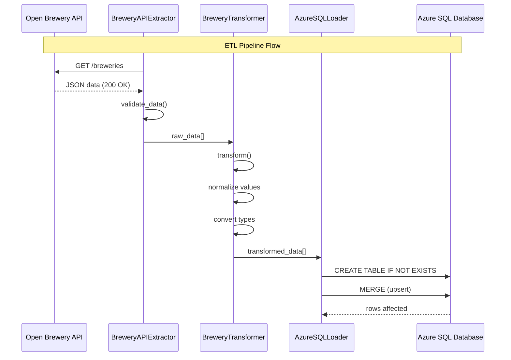
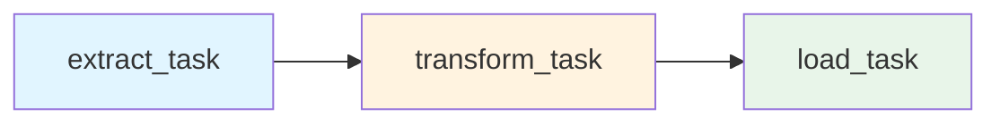
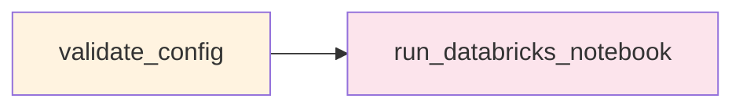
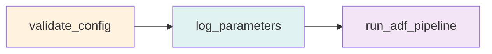
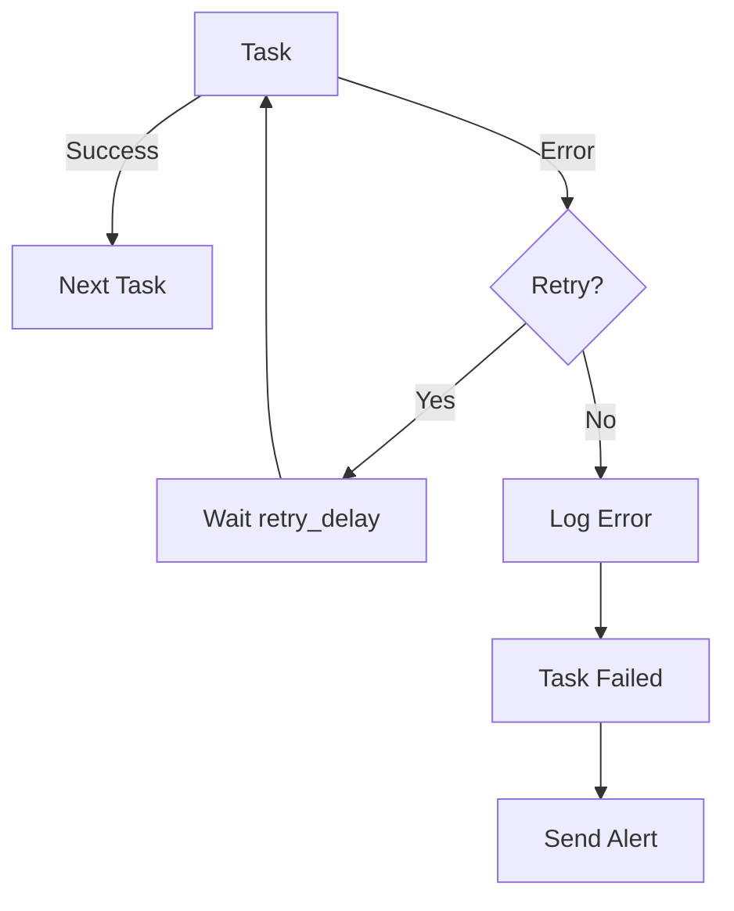

# Fluxo de Dados

## 🔄 Visão Geral do Pipeline ETL



## 📊 DAG: brewery_etl_solid

### Estrutura das Tasks



### Task 1: Extract

**Responsabilidade:** Extrair dados da API

```python
def extract_brewery_data(**context):
    # 1. Criar extractor via Factory
    extractor = ETLFactory.create_brewery_extractor(api_config)
    
    # 2. Extrair dados
    data = extractor.extract()  # Chamada HTTP
    
    # 3. Compartilhar via XCom
    ti = context['ti']
    ti.xcom_push(key='raw_data', value=data)
```

**Dados:**
```json
[
  {
    "id": "5494",
    "name": "10 Barrel Brewing Co",
    "brewery_type": "micro",
    "city": "Bend",
    "state": "Oregon",
    ...
  }
]
```

### Task 2: Transform

**Responsabilidade:** Normalizar e validar dados

```python
def transform_brewery_data(**context):
    # 1. Obter dados raw
    ti = context['ti']
    raw_data = ti.xcom_pull(task_ids='extract_task', key='raw_data')
    
    # 2. Criar transformer
    transformer = ETLFactory.create_brewery_transformer()
    
    # 3. Transformar
    transformed_data = transformer.transform(raw_data)
    
    # 4. Compartilhar
    ti.xcom_push(key='transformed_data', value=transformed_data)
```

**Transformações aplicadas:**
- Truncar strings para limites de schema
- Converter tipos (float, int)
- Normalizar nulls
- Validar campos obrigatórios

### Task 3: Load

**Responsabilidade:** Carregar no Azure SQL

```python
def load_brewery_data(**context):
    # 1. Obter dados transformados
    ti = context['ti']
    data = ti.xcom_pull(task_ids='transform_task', key='transformed_data')
    
    # 2. Criar loader
    loader = ETLFactory.create_azure_sql_loader(sql_config)
    
    # 3. Criar tabela se necessário
    loader.create_table_if_not_exists()
    
    # 4. Carregar (MERGE - upsert)
    loaded_count = loader.load(data)
```

**SQL executado:**
```sql
-- 1. Create table
IF NOT EXISTS (SELECT * FROM sysobjects WHERE name='Breweries')
CREATE TABLE Breweries (
    id NVARCHAR(200) PRIMARY KEY,
    name NVARCHAR(255),
    ...
);

-- 2. MERGE (upsert)
MERGE Breweries AS target
USING (SELECT ? AS id) AS source
ON target.id = source.id
WHEN NOT MATCHED THEN
    INSERT (id, name, ...) VALUES (?, ?, ...);
```

---

## 🎯 DAG: databricks_processing_solid



### Task 1: Validate Config

**Fail-fast approach:** Valida configuração antes de execução cara.

```python
def validate_databricks_config(**context):
    config_checks = {
        'host': databricks_config.host,
        'cluster_id': databricks_config.cluster_id,
        'job_id': databricks_config.job_id,
    }
    
    # Check for placeholders
    for key, value in config_checks.items():
        if 'XXX' in str(value):
            raise ValueError(f"{key} not configured")
```

### Task 2: Run Notebook

**Executa notebook no Databricks com parâmetros contextuais.**

```python
DatabricksRunNowOperator(
    task_id='run_databricks_notebook',
    databricks_conn_id='databricks_default',
    job_id=databricks_config.job_id,
    notebook_params={
        'environment': airflow_config.environment,
        'execution_date': '{{ ds }}',
        'dag_run_id': '{{ run_id }}',
    }
)
```

---

## 🏭 DAG: azure_data_factory_solid



### Task 1: Validate Config

Valida credenciais e configurações do ADF.

### Task 2: Log Parameters

Cria audit trail dos parâmetros passados ao pipeline.

### Task 3: Run Pipeline

Dispara execução do pipeline no Azure Data Factory.

---

## 📈 Métricas e Observabilidade

### Logging Estruturado

```python
log_task_start(logger, "extract_data", source="API")
# 🚀 Task Started: extract_data | source=API

log_task_success(logger, "extract_data", records=250, duration="2.3s")
# ✅ Task Completed: extract_data | records=250 | duration=2.3s

log_task_error(logger, "extract_data", error, retry_count=1)
# ❌ Task Failed: extract_data | Error: Connection timeout | retry_count=1
```

### XCom para Compartilhamento

```python
# Push data
ti.xcom_push(key='data', value=data)

# Pull data
data = ti.xcom_pull(task_ids='previous_task', key='data')
```

### Métricas Coletadas

- **Extração:**
  - Records extracted
  - API response time
  - Status codes
  
- **Transformação:**
  - Records in/out
  - Transformation time
  - Validation errors

- **Carregamento:**
  - Records loaded
  - Duplicates found
  - Load duration

---

## 🔀 Fluxo de Erros



### Tratamento de Erros

```python
try:
    data = extractor.extract()
except ExtractionError as e:
    log_task_error(logger, "extract", e)
    raise  # Airflow handles retry
```

### Configuração de Retry

```python
default_args = {
    'retries': airflow_config.default_retries,  # 2
    'retry_delay': timedelta(seconds=300),       # 5 min
}
```

---

## 📚 Próximos Passos

- [DAGs Detalhadas →](../dags/introduction.md)
- [Setup e Configuração →](../setup/initial-setup.md)
- [Troubleshooting →](../guides/troubleshooting.md)

