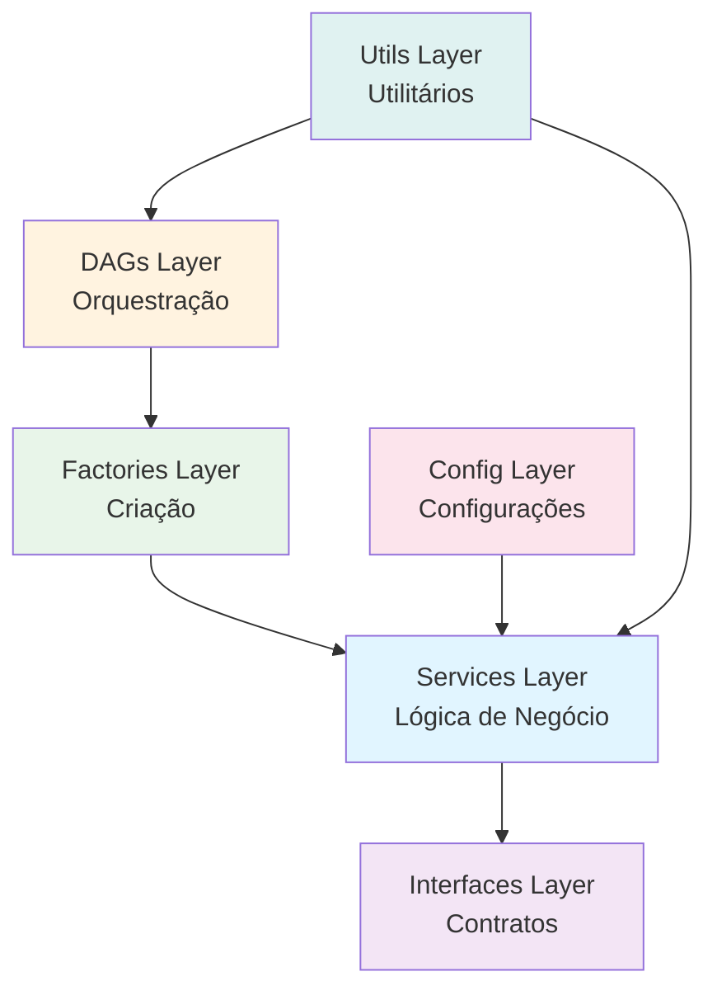

# Visão Geral da Arquitetura

## Arquitetura SOLID

O projeto implementa uma **arquitetura em camadas** baseada em princípios SOLID e design patterns profissionais.

### Princípios SOLID

| Princípio | Implementação | Benefício |
|-----------|---------------|-----------|
| **S**ingle Responsibility | Cada classe tem uma única responsabilidade | `BreweryAPIExtractor` apenas extrai dados |
| **O**pen/Closed | Aberto para extensão, fechado para modificação | Nova fonte? Implemente `IDataExtractor` |
| **L**iskov Substitution | Interfaces garantem substituição | Qualquer `IDataExtractor` é intercambiável |
| **I**nterface Segregation | Interfaces focadas e minimalistas | `IDataExtractor`, `IDataLoader`, `IDataTransformer` |
| **D**ependency Inversion | Depende de abstrações, não implementações | Configs injetadas via DI |

### Design Patterns



## Estrutura em Camadas

### 1. Config Layer

**Responsabilidade:** Centralizar configurações

```python
from config import DatabricksConfig, AzureSQLConfig

# Type-safe configurations
databricks_config = DatabricksConfig()
sql_config = AzureSQLConfig()
```

**Benefícios:**
- Type safety com dataclasses
- Immutability (frozen)
- Environment-driven
- Safe repr (não expõe secrets)

### 2. Interfaces Layer

**Responsabilidade:** Definir contratos (abstrações)

```python
from interfaces import IDataExtractor, IDataLoader

class BreweryAPIExtractor(IDataExtractor):
 def extract(self) -> List[Dict]:
 ...
```

**Benefícios:**
- Dependency Inversion Principle
- Testabilidade (mock interfaces)
- Substituibilidade

### 3. Services Layer

**Responsabilidade:** Implementações concretas

```python
from services import BreweryAPIExtractor, AzureSQLLoader

extractor = BreweryAPIExtractor(config)
data = extractor.extract()
```

**Benefícios:**
- Single Responsibility
- Reutilização
- Fácil manutenção

### 4. Factories Layer

**Responsabilidade:** Criação de objetos

```python
from factories import ETLFactory

# Factory cria objetos com dependências corretas
extractor = ETLFactory.create_brewery_extractor()
loader = ETLFactory.create_azure_sql_loader()
```

**Benefícios:**
- Criação centralizada
- Dependency Injection automática
- Fácil de testar

### 5. DAGs Layer

**Responsabilidade:** Orquestração

```python
# DAG usa factories e não se preocupa com detalhes
def extract_task(**context):
 extractor = ETLFactory.create_brewery_extractor()
 data = extractor.extract()
 ...
```

**Benefícios:**
- Código limpo
- Foco na orquestração
- Fácil leitura

## Benefícios da Arquitetura

### Testabilidade

```python
def test_brewery_extractor():
 # Mock config para teste
 mock_config = APIConfig(brewery_api_url="http://test")
 extractor = BreweryAPIExtractor(mock_config)

 data = extractor.extract()
 assert len(data) > 0
```

### Extensibilidade

```python
# Adicionar nova fonte é simples
class PostgreSQLExtractor(IDataExtractor):
 def extract(self) -> List[Dict]:
 # Nova implementação
 ...

# Usar é transparente
extractor = PostgreSQLExtractor(config)
data = extractor.extract() # Funciona!
```

### Manutenibilidade

```python
# Mudança localizada - não afeta outros componentes
class AzureSQLLoader(IDataLoader):
 def load(self, data: List[Dict]) -> int:
 # Melhoria apenas aqui
 ...
```

## Próximos Passos

- [Componentes Detalhados →](components.md)
- [Fluxo de Dados →](data-flow.md)
- [Exemplo Prático →](../dags/introduction.md)

## Referências

Para mais detalhes, consulte:
- [ARCHITECTURE.md](../../ARCHITECTURE.md) - Documentação técnica completa
- [config_usage_example.py](../../dags/examples/config_usage_example.py) - Exemplos práticos

