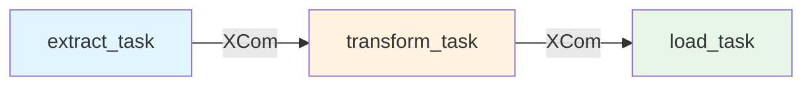

# ETL Brewery - Extract API to SQL

## 📊 brewery_etl_solid

**Arquivo:** `dags/brewery_etl_dag.py`

Esta DAG implementa um pipeline ETL completo para extrair dados de cervejarias da Open Brewery DB API e carregar no Azure SQL Database.

## 🎯 Visão Geral



## ⚙️ Configuração

```bash
# .env
BREWERY_API_URL=https://api.openbrewerydb.org/breweries
API_TIMEOUT=30
API_RETRY_ATTEMPTS=3

AZURE_SQL_SERVER=your-server.database.windows.net
AZURE_SQL_DATABASE=your_database
AZURE_SQL_USERNAME=your_username
AZURE_SQL_PASSWORD=your_password
```

## 📋 Tasks

### 1. extract_task

**Função:** `extract_brewery_data()`

Extrai dados da Open Brewery DB API usando `BreweryAPIExtractor`.

**Saída XCom:** `raw_data` - Lista de dicionários com dados brutos

### 2. transform_task

**Função:** `transform_brewery_data()`

Transforma dados usando `BreweryTransformer`:
- Normaliza valores null
- Trunca strings
- Converte tipos

**Entrada XCom:** `raw_data`  
**Saída XCom:** `transformed_data`

### 3. load_task

**Função:** `load_brewery_data()`

Carrega dados no Azure SQL usando `AzureSQLLoader`:
- Cria tabela se não existir
- MERGE (upsert) para evitar duplicatas

**Entrada XCom:** `transformed_data`

## 🚀 Execução

```bash
# Ativar DAG
astro dev run dags unpause brewery_etl_solid

# Trigger manual
astro dev run dags trigger brewery_etl_solid

# Ver logs
astro dev logs --follow
```

## 📊 Monitoramento

Logs estruturados em cada task:
- 🚀 Task Started
- ✅ Task Completed (+ métricas)
- ❌ Task Failed (+ erro)

## 📖 Ver Também

- [Introdução às DAGs](introduction.md)
- [Arquitetura de Dados](../architecture/data-flow.md)

