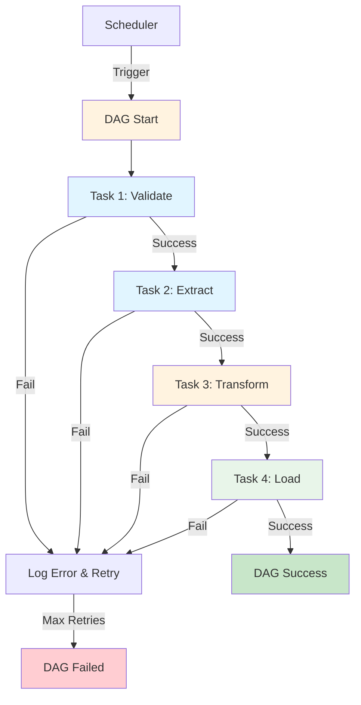

# Introdução às DAGs

## 📊 Visão Geral

O projeto possui **3 DAGs profissionais** implementadas com arquitetura SOLID:

| DAG | Função | Frequência | Status |
|-----|--------|------------|--------|
| [`brewery_etl_solid`](extract-api-sql.md) | ETL completo de dados de cervejarias | Diária | ✅ Produção |
| [`databricks_processing_solid`](databricks-notebook.md) | Processamento em Databricks | Diária | ✅ Produção |
| [`azure_data_factory_solid`](azure-data-factory.md) | Trigger de pipelines ADF | Diária | ✅ Produção |

## 🎯 Filosofia das DAGs

### Princípios Aplicados

1. **Dependency Injection** - Configurações injetadas via factories
2. **Single Responsibility** - Cada task tem um propósito claro
3. **Fail-Fast** - Validações antes de operações caras
4. **Observability** - Logging estruturado em todas as tasks
5. **Idempotência** - Execuções múltiplas não causam side effects

### Estrutura Padrão

```python
# 1. Imports
from config import AirflowConfig, APIConfig
from factories import ETLFactory
from utils.logger import get_logger

# 2. Configurations
api_config = APIConfig()
airflow_config = AirflowConfig()
logger = get_logger(__name__)

# 3. Task Functions
def my_task(**context):
    log_task_start(logger, "my_task")
    # Business logic
    log_task_success(logger, "my_task")

# 4. DAG Definition
default_args = {
    'owner': 'airflow',
    'retries': airflow_config.default_retries,
    ...
}

with DAG('my_dag', default_args=default_args, ...) as dag:
    task1 = PythonOperator(task_id='task1', ...)
    task2 = PythonOperator(task_id='task2', ...)
    
    task1 >> task2
```

## 🔍 Comparação: Antes vs Depois

### ❌ DAGs Antigas (Deprecated)

```python
# Problemas:
# - Senha hardcoded
# - IDs hardcoded
# - Sem tratamento de erros
# - Sem logging estruturado
# - Não testável

def insert_data():
    password = 'Doni*****'  # ❌ Hardcoded!
    cluster_id = '0626-205409-935ntddc'  # ❌ Hardcoded!
    # SQL direto misturado com lógica
    cursor.execute(...)
```

### ✅ DAGs Novas (SOLID)

```python
# Benefícios:
# - Configurações via environment
# - Arquitetura em camadas
# - Tratamento de erros profissional
# - Logging estruturado
# - Totalmente testável

def extract_data(**context):
    # Config injetada
    extractor = ETLFactory.create_brewery_extractor()
    
    # Logging profissional
    log_task_start(logger, "extract")
    
    try:
        data = extractor.extract()
        log_task_success(logger, "extract", records=len(data))
    except ExtractionError as e:
        log_task_error(logger, "extract", e)
        raise
```

## 📋 Default Args Padronizados

```python
from config import AirflowConfig

airflow_config = AirflowConfig()

default_args = {
    'owner': 'airflow',
    'depends_on_past': False,
    'start_date': datetime(2024, 10, 1),
    'email_on_failure': airflow_config.email_on_failure,
    'email_on_retry': airflow_config.email_on_retry,
    'retries': airflow_config.default_retries,
    'retry_delay': timedelta(seconds=airflow_config.retry_delay_seconds),
}
```

**Configurável via `.env`:**
```bash
AIRFLOW_DEFAULT_RETRIES=2
AIRFLOW_RETRY_DELAY=300
AIRFLOW_EMAIL_ON_FAILURE=True
```

## 🔄 Fluxo de Execução



## 🎨 Tags e Organização

Todas as DAGs usam tags para organização:

```python
with DAG(
    'brewery_etl_solid',
    tags=['etl', 'brewery', 'azure-sql', 'solid', 'production'],
    ...
) as dag:
    ...
```

**Tags disponíveis:**
- `etl` - Processos ETL
- `brewery` - Dados de cervejarias
- `azure-sql` - Azure SQL Database
- `databricks` - Databricks processing
- `azure` - Azure services
- `solid` - Arquitetura SOLID
- `production` - Aprovado para produção

## 📚 Documentação das Tasks

Cada task possui documentação inline via `doc_md`:

```python
extract_task = PythonOperator(
    task_id='extract_task',
    python_callable=extract_brewery_data,
    doc_md="""
    ### Extract Brewery Data
    
    Extracts brewery data from Open Brewery DB API.
    
    **Architecture:**
    - Uses `BreweryAPIExtractor` (implements `IDataExtractor`)
    - Configuration via `APIConfig`
    - Retry logic with exponential backoff
    
    **Output:** Raw brewery data in XCom
    """,
)
```

## 🚀 Próximas DAGs

| DAG Planejada | Propósito | Status |
|---------------|-----------|--------|
| `brewery_etl_incremental` | ETL incremental (apenas novos registros) | 📋 Planejado |
| `data_quality_check` | Validação de qualidade de dados | 📋 Planejado |
| `data_lake_sync` | Sincronização com Data Lake | 📋 Planejado |

## 📖 Saiba Mais

- [ETL Completo →](extract-api-sql.md)
- [Databricks Processing →](databricks-notebook.md)
- [Azure Data Factory →](azure-data-factory.md)
- [Arquitetura SOLID →](../architecture/overview.md)

