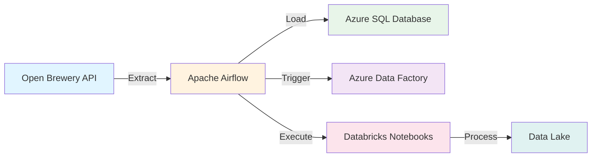

# Desafio InBev - Data Orchestration Platform

Bem-vindo à documentação oficial da **Plataforma de Orquestração de Dados InBev**.

## Visão Geral

Esta plataforma automatiza a extração, transformação e carga (ETL) de dados de cervejarias, integrando múltiplas tecnologias cloud e seguindo princípios de engenharia de software de nível enterprise.

### Destaques

<div class="grid cards" markdown>

- :material-security:{ .lg .middle } __Segurança Robusta__

 ---

 Credenciais gerenciadas via environment variables e Airflow Connections. Zero secrets no código.

 [:octicons-arrow-right-24: Boas Práticas](guides/best-practices.md)

- :material-cloud-check:{ .lg .middle } __Arquitetura SOLID__

 ---

 Implementação completa de princípios SOLID e design patterns profissionais.

 [:octicons-arrow-right-24: Arquitetura](architecture/overview.md)

- :material-docker:{ .lg .middle } __Docker Otimizado__

 ---

 Microsoft ODBC Driver 18 pré-configurado. Build rápido e eficiente.

 [:octicons-arrow-right-24: Setup](setup/initial-setup.md)

- :material-test-tube:{ .lg .middle } __Testável e Manutenível__

 ---

 Dependency Injection, interfaces e factories para código testável.

 [:octicons-arrow-right-24: Boas Práticas](guides/best-practices.md)

</div>

## Quick Start

```bash
# 1. Clone o repositório
git clone https://github.com/victorcappelleto/Desafio_InBev.git
cd Desafio_InBev

# 2. Configure variáveis de ambiente
cp env.template .env
nano .env # Preencha com suas credenciais

# 3. Inicie o ambiente Airflow
astro dev start

# 4. Acesse a interface web
# http://localhost:8080
# User: admin | Password: admin
```

[:octicons-arrow-right-24: Setup Completo](setup/initial-setup.md)

## Fluxo de Dados



## Tecnologias

| Tecnologia | Função | Status |
|------------|--------|--------|
| **Apache Airflow** | Orquestração de workflows | Configurado |
| **Azure SQL Database** | Armazenamento estruturado | Configurado |
| **Azure Data Factory** | Pipeline de integração | Configurado |
| **Databricks** | Processamento em larga escala | Configurado |
| **Docker** | Containerização | Configurado |
| **Python 3.11** | Linguagem principal | Configurado |

## Navegação da Documentação

### Para Desenvolvedores

- **[Setup Inicial](setup/initial-setup.md)** - Configure seu ambiente local
- **[Configuração](setup/connections.md)** - Connections, Variables e Pools
- **[DAGs](dags/introduction.md)** - Entenda as pipelines de dados
- **[Boas Práticas](guides/best-practices.md)** - Padrões de código

### Para Arquitetos

- **[Visão Geral](architecture/overview.md)** - Arquitetura SOLID
- **[Componentes](architecture/components.md)** - Estrutura em camadas
- **[Fluxo de Dados](architecture/data-flow.md)** - ETL pipeline

### Para DevOps

- **[Deployment](guides/deployment.md)** - Deploy em produção
- **[Troubleshooting](guides/troubleshooting.md)** - Resolução de problemas
- **[Monitoramento](guides/best-practices.md#monitoramento)** - Observabilidade

## Novidades

!!! success "Clean Architecture + DDD Implementada"
 O projeto agora implementa **Clean Architecture completa** com Domain-Driven Design (DDD), incluindo:

 - **Domain Layer** - Value Objects, Entities, Aggregates
 - **Use Cases Layer** - Extract, Transform, Load, Quality
 - **Repository Pattern** - Data access abstraction
 - **Unit of Work** - Transaction management

 [Ver arquitetura →](architecture/overview.md)

!!! tip "Data Quality Framework"
 Framework robusto de qualidade de dados com 6 dimensões ISO 8000:

 - Completeness, Accuracy, Consistency
 - Timeliness, Validity, Uniqueness
 - Pre-configured brewery quality engine

 [Ver Data Quality →](guides/data-quality.md)

!!! info "Observability Framework"
 Sistema completo de observabilidade com:

 - Metrics Collection (volume, freshness, quality)
 - Anomaly Detection
 - Multi-channel Alerts (Email, Slack)

 [Ver Observability →](guides/observability.md)

## Suporte

- **Issues:** [GitHub Issues](https://github.com/victorcappelleto/Desafio_InBev/issues)
- **Git History:** Todas as mudanças rastreadas via commits convencionais
- **Email:** victorcappelletto@gmail.com

## Licença

Este projeto foi desenvolvido como parte de um desafio técnico.

---

**Última atualização:** Outubro 2024 | **Versão:** 0.2.0
